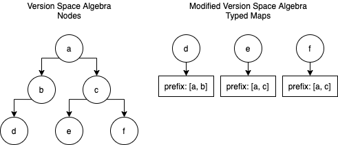

# Type Interface Synthesis for Unstructured Data

Steven Yuan

Professor Zhu

CS515

12/15/2020

## Problem

Modern technologies have continued to use unstructured data for a wide variety of cases (APIs, storage, databases, etc.). However, handling data from different sources in a single application is tedious and error prone although the processes on the data is generic. For each input source, a custom handler has to manually be defined which is both tedious and error-prone. json-synthesizer was designed to synthesize a generic typed interface using a modified version space algebra given input/output examples and transforms.

## Solution

json-synthesizer is a program synthesizer that takes a specification as input, containing input/output examples and transforms. A modified version space algebra is used by defining learn, union, and intersect operations on typed maps, representing unstructured data. Each input/output example is processed by restructuring and intersecting an input typed map and output typed map to produce a learned typed map. Then, each of the learned typed maps are unioned with each other to produce a single typed map which represents the final data structure. The final typed map is converted into typed JSON, a synthesized generic typed interface.

json-synthesizer is implemented in JavaScript in the Node.js runtime, which can be imported from the `synthesize` module of the source code.

### Architecture


The design of json-synthesizer is a pipeline, processing the input specification in various steps.

- First, a specification for the synthesizer is defined with input/output examples and transforms.
- Second, the input/output examples are each mapped to learned typed maps:
  - The input example is mapped to transforms based on source tags.
  - The transformed input example is converted to a typed map.
  - The output example is converted to a typed map
  - The input typed map and output typed map are restructured and intersected
- Third, the typed maps are reduced by union until there is a single typed map
- Finally, the final typed map is converted to typed JSON

The pipeline is abstracted from the user by only exposing the `synthesize` function, but the components are also exposed through nondefault exports.

### Specification

The specification for the synthesis is comprised of two parts: a list of input/output examples and a list of transforms.

```javascript
const specification = {
  inputOutputExamples: [
   {
     source: ['tag 1', /* ..., */ 'tag n'],
     input: {
       // Input JSON from Data Source (API, database, etc.)
     },
     output: {
       // Desired Output JSON from Transformed Input JSON
     }
   }
   // ... Multiple Input/Output Examples
  ],
  transforms: [
    {
      source: 'tag',
      // transform :: JSON -> JSON
      transform: json => { /* return Transformed JSON */ }
    },
    // ... Multipled Transforms
  ]
};
```

#### Input/Output Examples

Input/Output examples are defined in the specification as a list of objects which contain a `source`, `input`, and `output`:

```javascript
const inputOutputExamples = [
  // Input/Output Example
  {
    source: ['tag 1', /* ... */, 'tag n'],
    input: {
      // Input JSON from Data Source (API, database, etc.)
    },
    output: {
      // Desired Output JSON from Transformed Input JSON
    }
  },
  // ... Multiple Input/Output Examples
];
```

The `source` is a list of semantic tags to classify inputs which are used to identify which transforms should be applied. It should be noted that the order of the tags will not affect the order of the transforms applied.

The `input` is JSON data which can be acquired from any data source. The input is not allowed to have duplicate keys, defined as keys with identical names that can be reached with the dot `.` operator from a root object. If data from an input source does contain duplicate keys, the data can be cleaned by applying transforms that either rename the conflicting keys or remove the key/value pair.

The `output` is the desired structure and types in normal JSON. Any keys and types used later in the synthesis will be limited here regardless of the input data. However, it should be noted that the output assumes keys and values not from the original input but the transformed input, so it is important to keep track of each applied transforms' changes to the keys and values.

#### Transforms

Transforms are defined in the specification as a list of objects which contain a `source` and `transform`:

```javascript
const transforms = [
  // Transform
  {
    source: 'tag',
    // transform :: JSON -> JSON
    transform: json => { /* return Transformed JSON */ }
  },
  // ... Multiple Transforms
];
```

The `source` is a semantic tag that is associated with input/output examples. Only input/output examples that include the tag in its source will have the transform applied.

The `transform` is a function that takes in JSON as an argument and returns JSON (`transform :: JSON -> JSON`). This is important as multiple transforms can be applied to a single input, so without the type signature, the transform pipeline may cause an error. The order of transforms applied to inputs is the order defined in the list, so managing the order of the transforms is important. Transforms can range in functionality, from simply [renaming keys](https://github.com/syall/json-synthesizer/tree/main/examples/transforms/renameTransform.js) to [unmarshalling DynamoDB](https://github.com/syall/json-synthesizer/tree/main/examples/transforms/unmarshallDynamoJson.js). The transform functions' correctness and safety is wholly dependent on the user, as there is no template for the possible range of transforms.

### Version Space Algebra

json-synthesizer uses a modified version space algebra, a framework that represents sets of programs can be represented as version space nodes. By applying operations on these nodes, a program can be synthesized that can satisfy the input specification. json-synthesizer uses typed maps as nodes with the learn, union, and intersect operations defined, ending with synthesized typed JSON converted from the final typed map.

#### Types

Each type of a key's value is represented by an object which contains `array`, `object` and `types`:

```javascript
const type = {
  array: type /* | null */,
  object: new Map([/* key/value pairs */]) /* | null */,
  types: new Set([/* single value types*/]) /* | null */
};
```

Every key in a typed map has an associated type which represents the union of types that the key could be. If the entry in type is null, it means that the key is not that type; on the other hand, the key could be one of the non-null entries.

For example, if `entry` had a type:

```javascript
const example = {
  entry: {
    // An array
    array: {
      // Not of arrays
      array: null,
      // Not of objects
      object: null,
      // Of numbers and booleans
      types: new Set(['number', 'boolean'])
    },
    // Not an object
    object: new Map([
      [
        'sample',
        {
          prefix: [],
          type: {
            // Not an array
            array: null,
            // Not an object
            object: null,
            // null
            types: new Set(['null']) 
          }
        }
      ]
    ]),
    // A string
    types: new Set(['string'])
  }
};
```

So, `entry` could be a:

- Array containing numbers and booleans
- Object with a key of `sample` that can be null
- String

The `array` entry is a recursion definition of type for the elements which could be in the array, including recursive definitions for arrays of arrays and arrays of objects.

The `object` entry is a typed map which defines the entries of the object at that level, each of which has a type.

The `types` entry is a javascript Set of single value types which have no recursive types. The single value types are string, number, boolean, and null.

#### Typed Maps

Each typed map is represented by a javascript Map containing entries of keys mapped to an object with a `prefix` and `type`:

```javascript
const typedMap = new Map([
  // Key/Value Entry
  [
    // Key in object
    'key',
    // Value in object
    {
      // Dot `.` path
      prefix: ['key1', /* ..., */ 'keyn'],
      // Type of Key
      type: {
        array: null,
        object: null,
        types: null
      }
    }
  ],
  // ... Multiple Key/Value Entries
]);
```

The key of an entry of an object is represented as a key in the typed map. This implies that there cannot be multiple keys of the same name in an object. json-synthesizer is strict with its duplicate key restriction, defined by dot `.` paths, in order to better fit the operations in the version space algebra. Particularly, only keys that can be concrete values (arrays, single value types) are kept with their prefix in the map. Although one could construct a typed map to have a recursive structure like JSON, it forfeit any benefits to using a map.

The value of an entry contains a prefix and type. The prefix is a list of the keys in the dot `.` path from the root object. This is opposed to having the recursive structure of JSON which increases the complexity of traversal. The type is the type of the value, which is covered in the [Types section](#types).



#### Typed JSON

Typed JSON is the product of serializing typed maps into JSON. By recursing through the entries of a typed map, the position of the keys in the structure can be rebuilt from the prefix annotated with the type as its value. Each type is converted: the `array` type converted by recursion if not null, the `object` typed map converted by converting typed maps into JSON, and the `types` converted from a Set to a list.

```javascript
const convertedTypedMap = {
  // Typed JSON Key/Value Pair
  entry: {
    array: convertedType /* | null */,
    object: convertedTypedMap /* | null */,
    types: Array.from(types) /* | null */
  }
  // ... More entries in object
};
```

The synthesized program is Typed JSON with a formalized EBNF grammar.

```text
<typed-json>  ::= <object>
<object>      ::= '{' <key-list>? '}'
<key-list>    ::= <member> (',' <member>)*
<member>      ::= <key> ':' <type> 
<key>         ::= # See JSON specification for string: https://www.json.org
<type>        ::= '{' <array-type> ',' <object-type> ',' <types-type> '}'
<array-type>  ::= '"array"' ':' (<type> | <null>)
<object-type> ::= '"object"' ':' (<object> | <null>)
<types-type>  ::= '"types"' ':' (<types-list> | <null>)
<types-list>  ::= '[' <single-list>? ']'
<single-list> ::= <single-type> (',' <single-type>)*
<single-type> ::= '"string"' | '"number"' | '"boolean"' | '"null"'
<null>        ::= 'null'
```

#### Learn

The modified version space algebra has an analogous learn operation to produce version spaces from the input/output examples:

```text
Version Space Algebra Learn Operation:
learn <input, output> -> version space

Analogous json-synthesizer Learn Operation:
restructure <input JSON, output JSON> -> typed map
```

The learn operation for json-synthesizer decides the key/value types and structure based on the input JSON and output JSON. Since json-synthesizer deals with JSON data structures, learning an example is not about functional requirements but structural constraints, thus the learn operation is more aptly named restructuring. To prepare for restructuring, the input JSON first has the applicable transforms applied. Then, both the input JSON and output JSON are converted to typed maps. Learning for the structure of the output occurs by changing the prefix paths for keys in the input typed map based on the output typed map; also, the learned typed map only includes keys from the input typed map if the keys exist in the output typed map. Learning for the key/value types is done by intersection of the input and output typed maps. So, for each input/output example, a single typed map is produced by constraining the input JSON with structural and type constraints of the output JSON.

#### Intersect

The modified version space algebra has an analogous intersection operation for version spaces:

```text
Version Space Algebra Intersect Operation:
version space 1 ∩ version space 2 -> version space

Analogous json-synthesizer Intersect Operation:
typed map 1 ∩ typed map 2 -> typed map
```

The intersect operation for json-synthesizer intersects both keys and types, producing a typed map with the intersected keys and types. In traditional version space algebra, the intersect operation intersects two sets of programs; however, json-synthesizer intersection focuses on the structural and type constraints. First, only keys that exist in both input typed maps will be included in the intersected typed map; however, if the duplicate key restriction is violated, the intersection will fail due to no decision heuristic. For each of the keys included in both typed maps, the types of the values will be recursively intersected by checking the array, object, and single value types to produce a minimal type. So, for the input typed maps, a single typed map is produced by intersecting keys and types.

#### Union

The modified version space algebra has an analogous union operation for version spaces:

```text
Version Space Algebra Union Operation:
version space 1 ∪ version space 2 -> version space

Analogous json-synthesizer Union Operation:
typed map 1 ∪ typed map 2 -> typed map
```

The union operation for json-synthesizer unions both keys and types, producing another typed map with the unioned keys and types. In traditional version space algebra, the union operation unions two sets of programs; however, json-synthesizer union focuses on the structural and type constraints. First, any keys that exclusively exist in either of the input typed maps will be included in the produced typed map. Then, keys that exist in both input typed maps will be unioned in the produced typed map; however, if the duplicate key restriction is violated, the union will fail due to no decision heuristic. For each of the keys that exist in both typed maps, the types of the values will be recursively unioned by checking the array, object, and single value types to produce a maximal type. So, for the input typed maps, a single typed map is produced by unioning keys and types.

### Limitations

json-synthesizer has three main limitations: duplicate key restriction, loss of semantic keys, and limited type range.

#### Duplicate Key Restriction

Because typed maps are used, any key that can have a concrete value (arrays, single value types) cannot be duplicate in an object by dot `.` path. Input source JSON which have nested keys with duplicate keys have to be handled by transforms, otherwise the JSON will be incompatible with Typed Maps.

#### Loss of Semantic Keys

For some predefined schemas, the keys may have semantic meaning. However, the synthesizer treats any key in a dot `.` path simply as a label for structure with no semantic information.

#### Limited Type Range 

Because json-synthesizer uses Typed JSON as the type interface output, any synthesized output will be limited to the types defined in the [JSON specification](https://www.json.org/).

#### Limitations Example: DynamoDB

DynamoDB wraps each value with [Data Types](https://docs.aws.amazon.com/amazondynamodb/latest/developerguide/HowItWorks.NamingRulesDataTypes.html#HowItWorks.DataTypes) which provides a schema that highlights these three limitations. An example transform that resolves the some of the limitations can be found in [`examples/transforms/unmarshallDynamoJson.js`](https://github.com/syall/json-synthesizer/tree/main/examples/transforms/unmarshallDynamoJson.js).

Transforms are required for DynamoDB to resolve the duplicate key restriction, as any values with the same data type will result in duplicate keys. This particular transform is named unmarshalling, removing the data type key layers while converting the values into those corresponding data types.

However, even if the duplicate key restriction did not exist, the synthesizer would not be able to recognize the semantic keys of the data types. By default, each of the data types would just be considered a structural key in a dot path. So, the unmarshalling transform is still needed to convert the values to corresponding types.

Even more, even with unmarshalling, not all converted types can be accurate since not all data types in the DynamoDB schema are compatible with the JSON specification. Unsupported data types have to convert to a similar but not equivalent type, such as Sets to Arrays.

```javascript
const dynamoExample = {
  // 'Surname', 'Address' have children duplicate keys 'S' which must be
  // transformed, otherwise the synthesizer will fail.
  'Surname': { 'S': 'Smith' },
  'Address': { 'S': '123 Mulberry Lane' },
  'Members': {
    'L': [
      // Even in an Array, which creates a new dot scope from the parent Object,
      // 'Name' and 'Education' have duplicate keys 'S' in a child Object that
      // need to be transformed.
      {
        'M': {
          'Name': { 'S': 'John' },
          'Age': { 'N': '34' },
          'Education': { 'S': 'GED' }
        }
      },
      {
        'M': {
          'Name': { 'S': 'Jane' },
          'Age': { 'N': '32' },
          'Education': { 'S': 'PHD' }
        }
      },
      {
        'M': {
          'Name': { 'S': 'Jack' },
          'Age': { 'N': '2' }
        }
      },
    ]
  },
  // 'Count' has a semantic key 'N' representing  Number, but the synthesizer 
  // does not consider that semantic information when restructuring the output.
  // The information can only be extracted with a user defined transform.
  'Count': { 'N': '4' },
  // 'Relatives' has a semantic key 'SS' that represents a type String Set.
  // Unlike 'Count', even if the information is extracted in a transform, the
  // information cannot be a direct translation due to the limited type range
  // in the JSON Specification (the Set type is not supported). Instead, the
  // transform will have to convert the String Set to a similar type such as a
  // String Array.
  'Relatives': {
    'SS': [
      'Jones',
      'Johnson',
      'Miller',
      'Williams'
    ]
  }
};
```

### Examples

Sample scripts can be found in [`examples/presentation/`](https://github.com/syall/json-synthesizer/tree/main/examples/presentation) of the source code.

## Evaluation

json-synthesizer is mainly evaluated in two ways: complexity and correctness.

### Complexity

Because the implementation uses Typed Maps as opposed to traditional Version Space Nodes, json-synthesizer should have a better time complexity and roughly equivalent space complexity. For space complexity, traditional version space algebra will always store `n` keys in an object; on the other hand, typed maps only store keys that hold concrete values (arrays and single value types) which makes the `n` keys an upper bound rather than a fixed size. For any operation searching for keys, traditional version space algebra has a time complexity of `O(n)` for traversing a tree; however, typed maps can efficiently use get operations which are `O(1)`. For picking a program, traditional version space algebra and typed maps would have the same time complexity since all of the keys would have to be traversed to build the synthesized type interface.

Task         | Traditional | Modified
-------------|-------------|---------
Store Keys   | O(n)        | O(n)
Search Keys  | O(n)        | O(1)
Pick Program | O(n)        | O(n)

Although searching keys may seem like the only advantage for using typed maps, the frequency and purpose of using search makes a noticeable difference in the synthesis. In all of the version space algebra operations (learn, intersect, union), searching keys typically occurs between keys in one map to the other typed map: for every key in one typed map, a search needs too be performed in the other typed map. Given this context, the traditional version space algebra operations' complexity becomes `O(n^2)`, significantly higher than the modified version space algebra operations' complexity `O(n)`.

### Correctness

The implementation opts to follow functional programming principles for the version space algebra operations, implying if individual functions are correct and consistent, then any composition or workflow using these functions should also be correct and consistent. Because of this, json-synthesizer has a thorough test suite which granularly unit tests all reasonable cases given the function definition. As long as the limitations of the synthesizer are not broken, any specification should be able be able to synthesize a type interface with confidence.

## Related Work

[“Version Space Algebra and its Application to Programming by Demonstration” by Tessa Lau, Pedro Domingos, Daniel S. Weld](./related/VSA-PBD.pdf) is referenced as the canonical paper on version space algebra synthesis. Version space algebra is applied to building programs by supplying input/output examples, known as programming by demonstration. Each of these examples are learned to produce atomic version spaces that represent sets of programs that fit a hypothesis. Then, composite version spaces can be formed by applying union, intersection, and join operations. A program synthesized when all input/output examples are satisfied, executing transforms between version spaces based on heuristic search.

[“Error-Tolerant Version Space Algebra” by Eugene R. Creswick, Aaron M. Novstrup](./related/TOLERANT-VSA.pdf) explores extending version space algebra with heuristics for error tolerance. The framework allows for more flexible input/output examples which is helpful since user definitions cannot always be expected to be consistent or correct. The “similar” heuristic operation may be useful for the duplicate key restriction in json-synthesizer by conservatively narrowing sets of valid hypotheses when compared to the original input/output examples. Another observation is that learning does not improve with repeated demonstration, meaning the number of multiple input/output examples does not matter if they are similar enough.

## Proposal

The initial project proposal can be found in [PROPOSAL.md](./PROPOSAL.md).

Comments from Professor He Zhu: "This is great. You may need to pay attention to designing and identifying useful library functions in your grammar."

json-synthesizer ended up with a structural grammar rather than a grammar with library functions, so the comments were not relevant to the domain.

## Reflection

json-synthesizer was created as a final project for Rutgers University CS16:198:515 Programming Languages and Compilers I in Fall 2020 with the topic of Program Synthesis in Fall 2020.

I had taken the course expecting a traditional class about compilers, but instead I was greeted with program synthesis. To an extent I was disappointed, but on the other hand the topic became interesting to me, albeit difficult to understand.

The idea of transpiling data structures from one schema had been a project idea of mine for a long time, but I never knew how to approach the problem. My original idea was to simply write out a specification, parse JSON, and write custom handlers, but even that was too difficult for me.

Then during one lecture on representation-based search, the professor talked about version space algebra, operating on sets of programs that fit a specification until a final program was picked. I thought that the recursive nature of version space algebra could be a perfect fit for putting smaller JSON components together until a final product represented the JSON data structure desired.

However, during implementation I found this not only complex but also without much technical benefit. The search would be exponential and confusing, particularly with duplicate keys. A program could be synthesized with duplicate keys at different levels which would fit the output examples, but if keys had the same or encapsulated types, which program would be the best fit? At first I considered having the most minimal type, but if it was wrong then there would be loss of data.

Either way, duplicate key resolution was complex due to unreliable heuristics, so I opted to apply a restriction to not have them. With that restriction, a new possibility emerged: if all keys are unique, then that meant the components did not have to have a recursive structure but could instead be represented with maps. This reduced the complexity in theory and implementation, only storing information about keys that had associated concrete types.

The actual implementation of operating on JSON, typed maps, types, and typed JSON proved to be technically complex not due to lines of code, but because of the recursive nature of these objects. Just wrapping my head around the traversals took a lot of time, but the result of enumerating all the cases was rewarding.

So, although json-synthesizer became different than what I had originally entailed for a project, I believe that what it is now is more versatile and efficient due to the modified version space algebra with Typed Maps.
